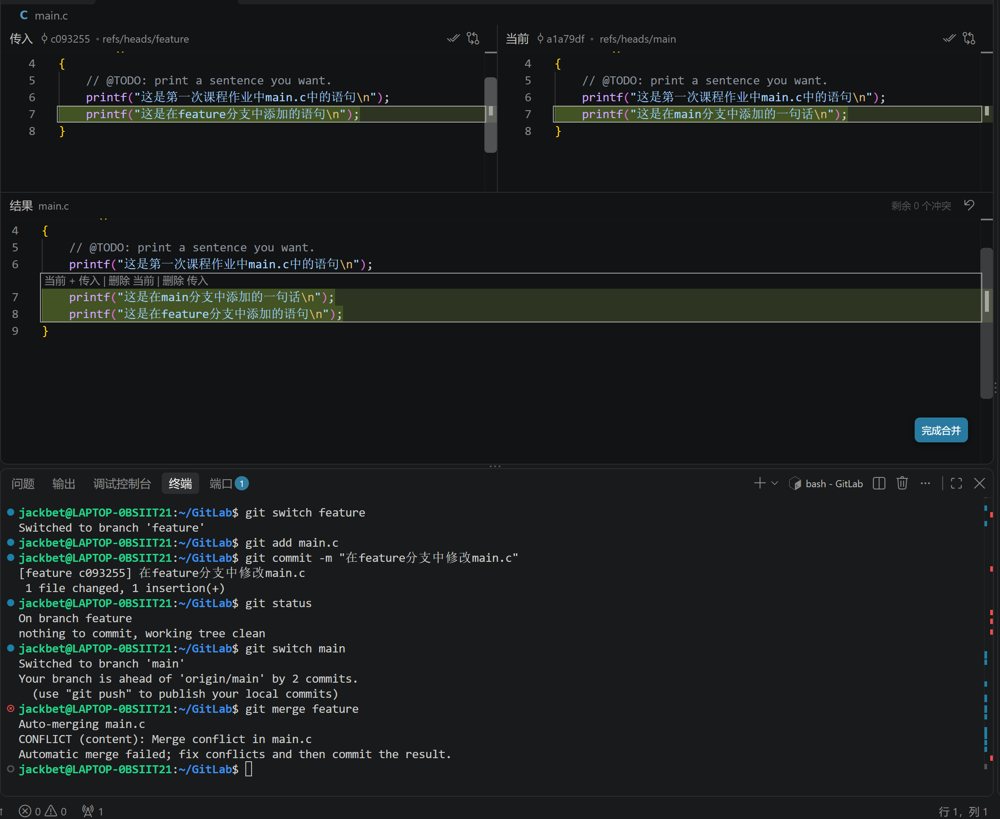

# Lab 0：Git 实验报告

## 一、基本信息

| 项目         | 内容                                                                              |
|:---------- | ------------------------------------------------------------------------------- |
| 姓名         | 张泽宇                                                                             |
| 学号         | 24300200009                                                                     |
| GitHub 用户名 | jackbetx2-source                                                                |
| 个人仓库地址     | https://github.com/jackbetx2-source/GitLab                                      |
| 实验日期       | 2026/9/30                                                                       |
| 实验环境       | Windows 系统，使用 WSL 2 运行 Ubuntu，使用 VS Code（WSL 扩展）编辑代码，使用 Git 进行版本管理，GitHub 托管仓库。 |

## 二、Git 基础问题（15 分）

### 2.1 你之前有过多人协同开发的经历吗？如果有，你们是使用什么方式分工协作的？

我曾在参加数学建模比赛时有过多人协同开发的经历。当时没有使用 Git，大家主要各自修改代码，缺少统一的版本管理和修改同步方式。因此，经常出现各自的代码版本不一致、修改没有及时同步的情况，给后续协作带来了不少麻烦。此外，我们很难清楚地追踪每个版本对应哪些改动，查找和比较历史版本也比较困难。这段经历让我认识到，多人开发除了分工，还需要有清晰的修改记录和代码整合方式。

### 2.2 Git 为什么要设计“暂存—提交”两个步骤？

我认为，Git 将“暂存”和“提交”分成两个步骤，是为了让开发者能够先整理本次要记录的内容，再形成一条目的明确的版本记录。

工作区保存正在编辑的文件；执行 `git add` 后，选中的文件内容会进入暂存区，作为下一次提交的准备；执行普通的 `git commit` 时，Git 根据暂存区的内容创建提交。因此，一次提交不必包含工作区中的全部修改。暂存后如果又修改了文件，新改动还需要再次暂存，才会包含在这次提交中。

例如，我同时修改了 `main.c` 并开始撰写实验报告，但目前只完成了代码修改，就可以先执行 `git add main.c`，再提交代码，而将尚未完成的报告留在工作区。这样可以避免将不同目的或尚未完成的修改混在一起，也便于提交前检查内容，使后续查阅历史、定位问题和撤销某项修改更加清楚。

### 2.3 `git branch` 和 `git branch -a` 的区别是什么？

`git branch` 在不附加其他参数时列出本地分支，例如 `main` 和 `feature`，当前所在分支前会带有 `*` 标记。

`git branch -a` 中的 `-a` 是 `--all` 的简写，会同时列出本地分支和远程跟踪分支，例如 `remotes/origin/main`。因此，两条命令的主要区别在于是否包含远程跟踪分支。

远程跟踪分支是本地保存的远程分支状态记录，并不等同于实时查询 GitHub 上的分支。`git branch -a` 本身不会联网更新这些记录；需要更新时，可以先执行 `git fetch origin`，再查看分支列表。

参考资料：[Git 官方文档：git branch](https://git-scm.com/docs/git-branch)。

## 三、通过模板创建仓库并完成首次修改（50 分）

### 3.1 创建个人仓库

按照课程网页介绍的过程，使用课程模板仓库 `ICS-26Fall-FDU/GitLab` 创建个人仓库。

- 我的仓库地址：[jackbetx2-source/GitLab](https://github.com/jackbetx2-source/GitLab)

### 3.2 克隆仓库并打开项目

创建个人仓库后使用命令将仓库克隆到WSL系统的~/GitLab文件夹

实际使用的命令：

```bash
cd ~
git clone git@github.com:jackbetx2-source/GitLab.git
```

### 3.3 修改 `main.c` 中的 TODO

我修改了 `main.c` 中输出语句的内容，使程序输出“这是第一次课程作业中main.c中的语句”，完成了 TODO 部分。修改后的代码如下：

```c
#include <stdio.h>

int main()
{
    // @TODO: print a sentence you want.
    printf("这是第一次课程作业中main.c中的语句\n");
}
```

### 3.4 提交修改

修改并保存文件后，我先使用 `git add main.c` 将修改加入暂存区，再使用 `git commit` 提交暂存的内容，完成了本次代码修改的版本记录。

## 四、拓展阅读与理解（15 分）

### 4.1 第一篇阅读

- 文章标题：Commit message 和 Change log 编写指南
- 文章链接：[阮一峰的网络日志](https://www.ruanyifeng.com/blog/2016/01/commit_message_change_log.html)

内容概括：

这篇文章主要介绍怎样把提交说明写清楚。它以 Angular 规范为例，用 `feat`、`fix`、`docs` 等类型区分新增功能、修复问题和文档修改，再用简短的文字说明这次提交做了什么。统一格式方便查看和筛选历史记录，也能配合工具生成版本更新日志。

我的理解：

我觉得提交说明是留给队友和以后的自己看的。如果每次都只写“修改了一下”，之后还是不知道改了什么。把改动说清楚，才能更容易找到需要的版本，也能减少协作时反复询问的麻烦。

### 4.2 第二篇阅读

- 文章标题：语义化版本 2.0.0
- 文章链接：[语义化版本规范](https://semver.org/lang/zh-CN/)

内容概括：

这篇文章介绍了一套版本号规则，格式是“主版本号.次版本号.修订号”，比如 `1.2.3`。在正式版本中，如果修改了接口，导致原来的用法不再兼容，就增加主版本号；如果新增功能但仍兼容原来的用法，就增加次版本号；如果只是修复问题且保持兼容，就增加修订号。已经发布的版本不能直接改内容，有改动就要发布新版本。这些约定能让使用者从版本号大致判断更新的影响，方便管理软件之间的依赖。

我的理解：

我以前更容易把版本号理解成一个编号，读完后发现它也能传达“这次改动有多大、原来的代码还能不能用”。比如从 `1.2.3` 升到 `1.2.4` 表示兼容的问题修复，而升到 `2.0.0` 就需要留意接口变化。我觉得这种约定比随意命名更清楚。Git 记录具体改了什么，语义化版本则帮助别人理解一次发布的变化，两者配合起来更方便查找和使用不同版本。

### 4.3 为什么要学习 Git？

结合之前数学建模比赛的经历，我觉得学习 Git 最直接的用处，就是弄清楚“谁改了什么”和“现在应该用哪个版本”。以前大家各自修改，代码容易不同步，想找回某次改动也很麻烦。用 Git 记录修改，再写清楚提交说明，查找和比较版本就方便多了。分支也能让不同任务分开进行，完成后再合并。当然，Git 不能代替沟通，但能让协作有记录可查。即使是一个人写代码，也可以更放心地尝试新想法，出问题时再查找或恢复之前的版本。

## 五、分支管理与合并冲突（20 分）

### 5.1 创建分支并分别修改

我先创建了 `feature` 分支，然后分别在 `main` 和 `feature` 分支中修改 `main.c`。两个分支都在原有输出语句的下方新增了一条输出语句，但内容不同。每次修改保存后，我都进行了暂存和提交。

`main` 分支新增的内容：

```c
printf("这是在main分支中添加的一句话\n");
```

`feature` 分支新增的内容：

```c
printf("这是在feature分支中添加的语句\n");
```

截图中，`main` 分支对应的提交为 `a1a79df`，`feature` 分支对应的提交为 `c093255`。其中，终端显示了在 `feature` 分支暂存和提交的过程：

```bash
git add main.c
git commit -m "在feature分支中修改main.c"
```

### 5.2 合并分支并遇到冲突

完成两个分支的提交后，我切回 `main` 分支，将 `feature` 合并进来：

```bash
git switch main
git merge feature
```

终端出现以下提示，说明自动合并失败，需要手动处理冲突：

```text
Auto-merging main.c
CONFLICT (content): Merge conflict in main.c
Automatic merge failed; fix conflicts and then commit the result.
```

这次冲突是因为两个分支都在同一位置插入了不同的内容，Git 无法自动确定应该怎样整合，需要由我决定保留哪些内容及其顺序。

### 5.3 在 VS Code 中处理冲突

我在 VS Code 的合并编辑器中查看了两边的改动：左侧的“传入”是 `feature` 分支，右侧的“当前”是 `main` 分支。我选择组合两边的改动，并把 `main` 的内容放在前面。

这两条语句只是输出不同的文字，可以同时保留。因此，我保留了原来的输出语句，并依次加入 `main` 和 `feature` 的新增语句。这里的“main 优先”表示排列顺序，并没有丢弃 `feature` 的改动。

合并编辑器中的结果如下：

```c
#include <stdio.h>

int main()
{
    // @TODO: print a sentence you want.
    printf("这是第一次课程作业中main.c中的语句\n");
    printf("这是在main分支中添加的一句话\n");
    printf("这是在feature分支中添加的语句\n");
}
```

下面的截图同时展示了终端中的冲突提示、两个分支的改动以及组合后的结果。编辑器显示“剩余 0 个冲突”，说明编辑器中的冲突内容已处理完毕。



### 5.4 完成合并提交

处理完冲突后，我完成了合并提交，并通过 `git log -1 --oneline` 确认当前位于 `main` 分支，最新提交为 `65bb746`，提交说明为 `Merge branch 'feature'`。

## 六、实验总结

通过这次实验，我学会了克隆仓库、暂存和提交修改、创建与切换分支，以及合并分支和处理冲突。我也理解了清楚记录每次改动的重要性，以后多人协作时可以用 Git 更方便地管理代码版本。
